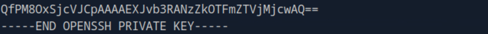

# Privilege Escalations

## Question 1

SSH into the server above with the provided credentials, and use the '-p xxxxxx' to specify the port shown above. Once you login, try to find a way to move to 'user2', to get the flag in '/home/user2/flag.txt'.


1st Step: Enter ssh command to enter the server

```
ssh [USERNAME]@[IP Address] -p [PORT NUMBER]
```

2nd Step: Enter "pwd" to see which directory you are in

3rd Step:  Enter sudo -l in order to see what sudo privileges we have

<figure><figcaption><p>At the most bottom line is shown NOPASSWD, this means we can access /bin/bash without a password</p></figcaption></figure>

4. It appears that now we have the bash access as user2.

<figure><figcaption></figcaption></figure>

5. Go into the home directory and access the files of user2, which we can then find the "flag.txt" file.
6. Use "cat flag.txt" to open the flag.txt file.

## Question 2

Once you gain access to 'user2', try to find a way to escalate your privileges to root, to get the flag in '/root/flag.txt'.

1. First we check our user.

<figure><figcaption><p>We are user2</p></figcaption></figure>

2. Try to access /root/flag.txt

<figure><figcaption><p>We aren't allowed to access it</p></figcaption></figure>

3. We access their SSH Key by going into "/root/.ssh/id\_rsa" and copy the SSH key from top to bottom.

<figure><figcaption><p>Start of SSH Key</p></figcaption></figure>

<figure><figcaption><p>End of SSH Key</p></figcaption></figure>

4. Open another terminal and make an "id\_rsa" file with the SSH key in it.

<figure><figcaption><p>You will have to know how to use vim to paste the contents into the id_rsa file.</p></figcaption></figure>

5. Cat "id\_rsa" file to check the contents
6. Log into the server using the ssh key

<figure><figcaption><p>You got access!</p></figcaption></figure>

7. Congratulations you now have access to the flag.txt

<figure><figcaption></figcaption></figure>
